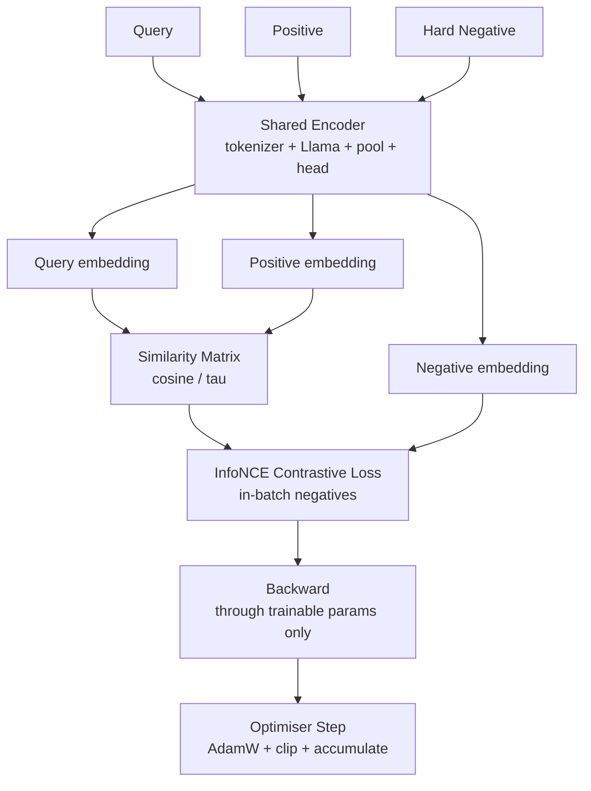
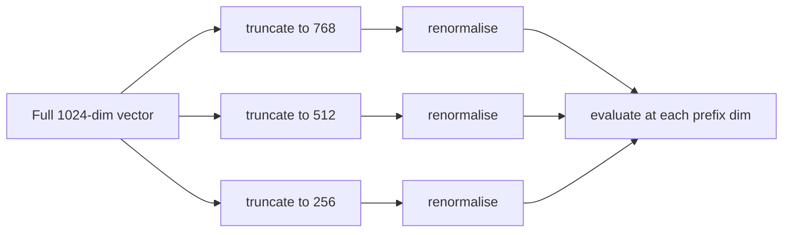

# Llama3.1-Embedding — Architecture

An independent embedding architecture built on Meta's Llama 3.1 **base**
(pretrained, non-instruct) model.

> **Status:** this repository currently ships the *architecture, training and
> evaluation framework*. No trained checkpoint and no published benchmark
> scores exist yet. Every table that would need measurements says
> NOT YET BENCHMARKED.

---

## 1. Inference path

```mermaid
flowchart TD
    A[Input Text] --> B[Tokenizer<br/>Llama 3.1 BPE, unmodified]
    B --> C[Llama 3.1 Base Transformer<br/>32 layers, hidden 4096]
    C --> D[Last Hidden States<br/>B x T x 4096]
    D --> E{Attention-Mask-Aware<br/>Pooling}
    E -->|mean| F1[Sentence Representation<br/>B x 4096]
    E -->|last_token| F1
    E -->|weighted_mean| F1
    F1 --> G[Embedding Projection<br/>Linear 4096 to D]
    G --> H[LayerNorm<br/>configurable]
    H --> I[L2 Normalisation<br/>||v|| = 1]
    I --> J[Final Dense Embedding<br/>B x D]
    J --> K[Cosine Similarity / Vector Search]

    style D fill:#1f3a5f,stroke:#4a90d9,color:#fff
    style J fill:#1f5f3f,stroke:#4ad98a,color:#fff
    style K fill:#5f3a1f,stroke:#d9a04a,color:#fff
```

`D` is configurable to **256 / 384 / 512 / 768 / 1024** (default **768**).

The language-model head is never used. `AutoModel` is loaded (not
`AutoModelForCausalLM`) and `last_hidden_state` is what the embedding is built
from — never the vocabulary logits. Avoiding the 128k-way projection also saves
several GB of activations per forward pass.

---

## 2. Training path



The **same encoder** produces all three sides, so query and document vectors
live in one shared space. Off-diagonal entries of the similarity matrix act as
in-batch negatives; explicitly supplied hard negatives are scored alongside
them.

```
L = -1/B * sum_i log( exp(sim(q_i, d_i)/tau)
                        / sum_j exp(sim(q_i, d_j)/tau) )
```

`tau = 0.02` is a **documented software default** (the default used by widely
deployed sentence-embedding implementations), not a tuned optimum. Sweep it on
a validation split.

---

## 3. Component inventory

| Component | File | Frozen / Trainable | Notes |
|---|---|---|---|
| Tokenizer | `llama_embedding/tokenizer.py` | **Frozen** | Used exactly as shipped; no vocab changes |
| Llama 3.1 backbone | `llama_embedding/model.py` | see matrix below | `AutoModel`, hidden states only |
| Pooling | `llama_embedding/pooling.py` | n/a (no params) | Mask-aware; padding provably excluded |
| Projection `Linear` | `llama_embedding/projection.py` | **Trainable** | `4096 -> D`, ~3.1M params |
| LayerNorm | `llama_embedding/projection.py` | **Trainable** | Configurable on/off |
| L2 normalisation | `llama_embedding/projection.py` | n/a (no params) | Output is unit norm by construction |
| InfoNCE loss | `llama_embedding/losses.py` | n/a (no params) | Temperature configurable |
| LoRA adapters | `llama_embedding/lora.py` | **Trainable** | Only in `lora` mode |

---

## 4. What is frozen / trainable per mode

### `projection_only` (default, cheapest)

| Part | State | Params |
|---|---|---|
| Llama 3.1 backbone | **FROZEN** | 0 trainable |
| Pooling | — | 0 |
| `Linear(4096 -> D)` | **TRAINABLE** | `4096 * D` |
| LayerNorm (gamma, beta) | **TRAINABLE** | `2 * D` |

At `D=768` that is **3,147,264 trainable parameters ≈ 0.039 %** of the 8B model.

### `lora`

| Part | State | Notes |
|---|---|---|
| Llama base weights | **FROZEN** | PEFT freezes them |
| LoRA `A`/`B` on `q,k,v,o` | **TRAINABLE** | `r=16`, `alpha=32` |
| `Linear(4096 -> D)` | **TRAINABLE** | |
| LayerNorm | **TRAINABLE** | |

Gradient checkpointing should be enabled: backbone activations are retained.

### `full` (architecturally supported, **not** the default)

| Part | State |
|---|---|
| Every backbone parameter | **TRAINABLE** (~8 B) |
| Projection head | **TRAINABLE** |

For 8B this needs multi-GPU ZeRO/FSDP. The trainer **refuses to run**
`projection_only` or `lora` if more than 50 % of parameters end up trainable,
so it can never silently fine-tune the whole backbone.

---

## 5. Pooling

| Strategy | Formula | When to use |
|---|---|---|
| `mean` (default) | `sum_t m_t h_t / sum_t m_t` | General sentence embeddings |
| `last_token` | `h[last index where m_t = 1]` | Causal/LLM-style completions |
| `weighted_mean` | `sum_t w_t m_t h_t / sum_t w_t m_t` | Position-weighted documents |

All three are mask-aware. Padding is excluded **structurally** (multiplied out
before the sum), not by luck — the test suite writes large garbage values into
padded slots and asserts the output is bit-identical.

---

## 6. Matryoshka / variable dimensions

The head is a plain linear map followed by LayerNorm, which makes leading-slice
truncation meaningful:



Configuration hooks exist today (`embedding.matryoshka_dims`, the
`--matryoshka` flag, `--prefix-dims` in `scripts/benchmark.py`, and
`EmbeddingHead.truncate`). The Matryoshka **training** objective
(`matryoshka_info_nce`) is implemented and unit tested.

**However:** the ability to *use* small prefixes well only materialises after a
model is actually trained with `matryoshka_dims` set. Until that run happens and
is measured, this project makes **no claim** that prefix truncation works well.

---

## 7. Reproducibility

* One `seed` controls Python, NumPy and torch RNGs, dataset shuffling, the
  validation split and hard-negative sampling.
* Every run writes `embedding_config.json`, `metadata.json` and
  `train_log.jsonl`.
* `EmbeddingConfig.to_dict()` always nulls the HF token, so a credential can
  never reach a checkpoint, a log or Git.

---

## 8. What is NOT included

* No Llama weights — Meta's weights are gated and never redistributed here.
* No training dataset beyond 8 sample rows for smoke tests.
* No trained checkpoint.
* No benchmark scores. Nothing in this repository claims to beat any other
  embedding model.
